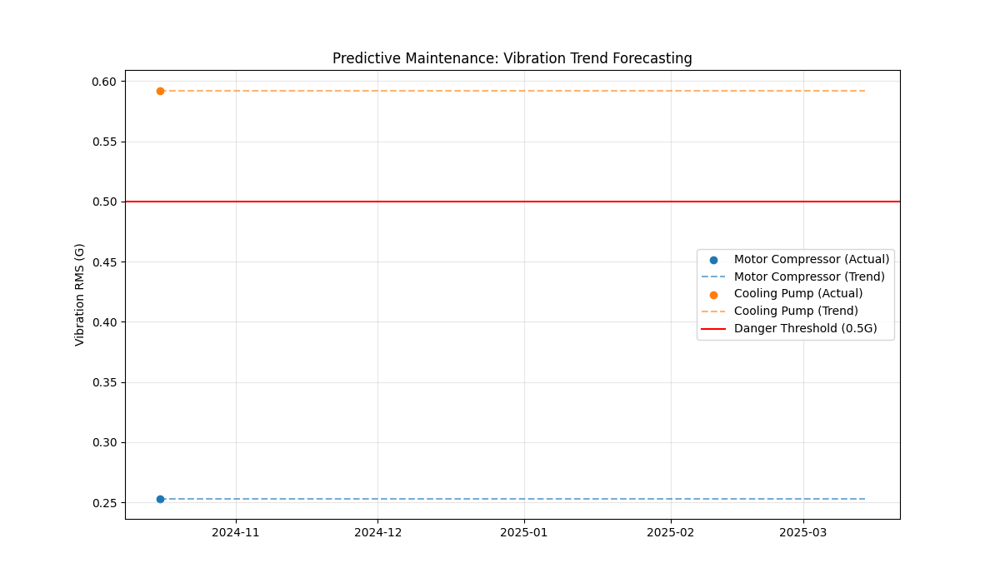

# Vibration Predictive Maintenance with Linear Regression

โปรเจคนี้คือการนำข้อมูลความสั่นสะเทือน (Vibration Data) จากเครื่องจักรจริงมาทำการวิเคราะห์และพยากรณ์สุขภาพของเครื่องจักร (Condition Monitoring) เพื่อวางแผนซ่อมบำรุงเชิงพยากรณ์ (Predictive Maintenance)

## 🛠 วิธีการดำเนินงาน (Methodology)

1.  **Data Acquisition**: รวบรวมข้อมูลความสั่นสะเทือนจากเครื่องจักร 2 ประเภท ได้แก่ Cooling Pump และ Motor Compressor ในช่วงเดือน มิ.ย., ก.ย., และ ต.ค. 2024
2.  **Data Processing**: 
    * ดึงข้อมูล Amplitude (Acceleration in G-s) จากไฟล์ข้อความ (.txt)
    * คำนวณค่า **RMS (Root Mean Square)** ซึ่งเป็นตัวบ่งชี้พลังงานความสั่นสะเทือนรวมตามมาตรฐานสากล
3.  **Trend Analysis & Modeling**: 
    * ใช้โมเดล **Linear Regression** (สถิติการถดถอยเชิงเส้น) เพื่อหาแนวโน้มความสัมพันธ์ระหว่าง "เวลา" และ "ความรุนแรงของการสั่น"
    * กำหนดเส้นตายอันตราย (**Threshold**) ไว้ที่ 0.5 G เพื่อใช้เป็นเกณฑ์ในการเฝ้าระวัง
4.  **Forecasting**: ทำนายค่าความสั่นสะเทือนไปในอนาคตเพื่อดูว่าเครื่องจักรมีแนวโน้มจะถึงจุดวิกฤตเมื่อใด

## 📊 สรุปผลการวิเคราะห์ (Analysis Results)



จากการวิเคราะห์ผ่านโมเดล พบข้อมูลสำคัญดังนี้:
* **สภาพปัจจุบัน**: เครื่องจักรทั้ง 2 ตัวยังมีค่า RMS อยู่ในเกณฑ์ปกติ (ต่ำกว่า 0.5 G)
* **Motor Compressor (Trend)**: มีแนวโน้มการสั่นสะเทือนเพิ่มขึ้นเล็กน้อยในลักษณะเส้นตรง แต่จากพยากรณ์พบว่ายังสามารถใช้งานได้ปลอดภัยอีกหลายเดือนก่อนจะถึงเกณฑ์เฝ้าระวัง
* **Cooling Pump (Trend)**: มีค่าความสั่นสะเทือนที่ค่อนข้างเสถียร (Stable) แสดงถึงสภาพเครื่องจักรที่ยังสมบูรณ์ดี

## 🚀 วิธีการใช้งานโปรเจค

1.  ติดตั้ง Library ที่จำเป็น:
    ```bash
    pip install -r requirements.txt
    ```
2.  ใส่ไฟล์ข้อมูล .txt ไว้ในโฟลเดอร์ `data/`
3.  รันการวิเคราะห์และดูผลพยากรณ์:
    ```bash
    python analysis.py
    ```

---
**Developed by:** [ชื่อของคุณ]
